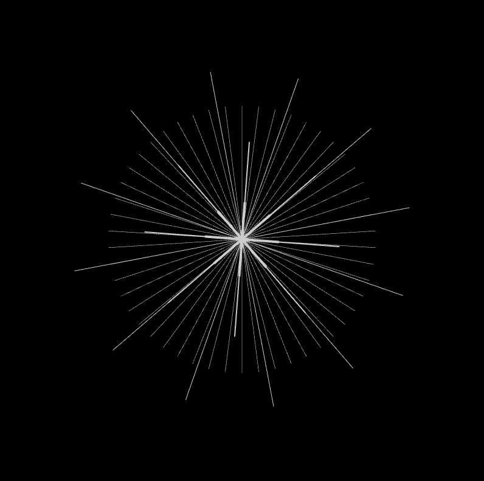

# 03-external-libraries

 Assignment 3 - External Libraries

 [Links are like this](https://google.com)
 
 [Reference tutorials 1: Three.js](https://www.youtube.com/watch?v=Q7AOvWpIVHU)

 [Reference tutorials 2: Three.js](https://www.youtube.com/watch?v=zrwUIS7rj54)

 For this project, We explored Three.js, p5 Riso Library, p5 Polar Library, Greensock animation.

 
 
 
 

 The index page in the main folder is mainly using threejs Geometries elements
 Folder: "threejs" contains geometries
 Folder: "riso-polar" contains p5.js Riso and Polar Libraries, also Greensock animation

